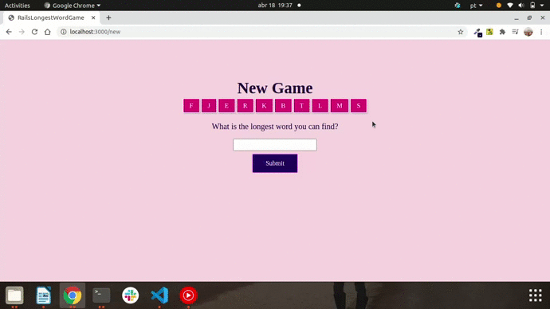
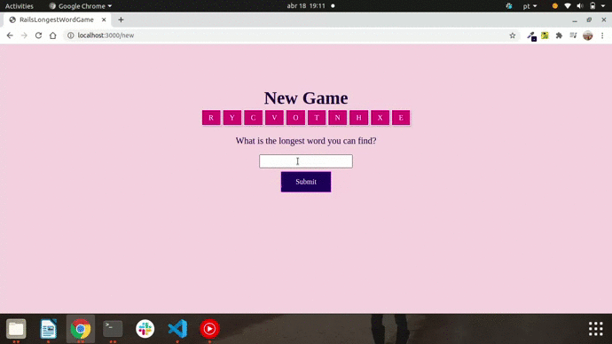
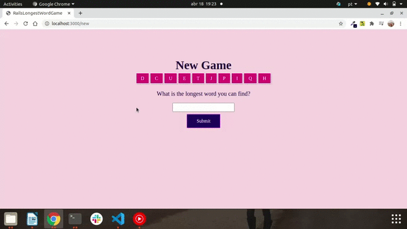

# Longest Word Game is a web application made with Ruby on Rails 💎 and Bootstrap. 

## It's given a random set of letters.
## You have to enter the longest english word you can find using only letters in the grid.

 

### There are three scenarios:

1. The word can’t be built out of the original grid.
   

    

2. The word is valid according to the grid, but is not a valid English word.
   

    
   
3. The word is valid according to the grid and is an English word.
   
